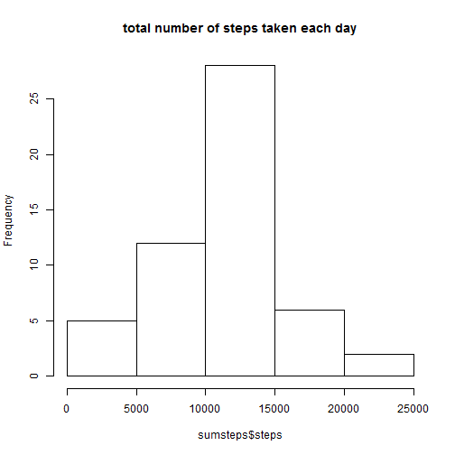
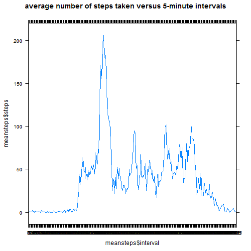
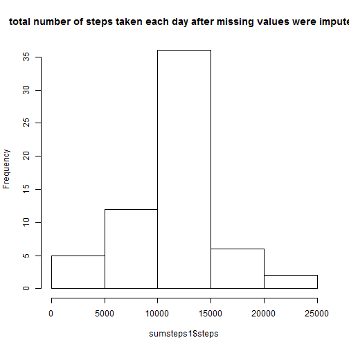
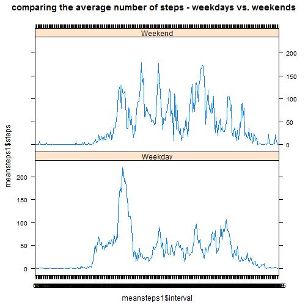

This is a R Markdown for the Assessment 1 of Reproducible Research course.


##Loading and preprocessing the data

_Set your working directory correctly._ 

Load the data and get a summary of the new data frame. Also, convert `interval` variable into a factor.


```r
setwd("~/Coursera/Reproducible research/Assingment 1/activity")
datasteps<-read.csv("activity.csv")
summary(datasteps)
```

```
##      steps                date          interval     
##  Min.   :  0.00   2012-10-01:  288   Min.   :   0.0  
##  1st Qu.:  0.00   2012-10-02:  288   1st Qu.: 588.8  
##  Median :  0.00   2012-10-03:  288   Median :1177.5  
##  Mean   : 37.38   2012-10-04:  288   Mean   :1177.5  
##  3rd Qu.: 12.00   2012-10-05:  288   3rd Qu.:1766.2  
##  Max.   :806.00   2012-10-06:  288   Max.   :2355.0  
##  NA's   :2304     (Other)   :15840
```

```r
datasteps$interval<-factor(datasteps$interval)
```

##What is mean total number of steps taken per day?

To calculate mean number of steps taken per day `aggregate()`
function has been used. This function ignores missing values by default. 


```r
sumsteps<-aggregate(steps~date, data=datasteps, sum)
```

Show the histogram of the total number of steps taken each day.


```r
hist(sumsteps$steps, main="total number of steps taken each day")
```



Calculate and report the mean and median of total number of steps taken per day


```r
mean(sumsteps$steps)
```

```
## [1] 10766.19
```

```r
median(sumsteps$steps)
```

```
## [1] 10765
```


##What is the average daily activity pattern?

Make a time series plot (i.e. `type = "l"`) of the 5-minute interval (x-axis) and the average number of steps taken, averaged across all days (y-axis)


```r
meansteps<-aggregate(steps~interval, data=datasteps, mean)
library(lattice)
xyplot(meansteps$steps~meansteps$interval, type="l", main="average number of steps taken versus 5-minute intervals")
```




Calculate the 5-minute interval, on average across all the days in the dataset, that contains the maximum number of steps


```r
meansteps[max(meansteps$steps),1]
```

```
## [1] 1705
## 288 Levels: 0 5 10 15 20 25 30 35 40 45 50 55 100 105 110 115 120 ... 2355
```

##Imputing missing values

Calculate and report the total number of missing values in the dataset (i.e. the total number of rows with `NA`s).


```r
sum(is.na(datasteps))
```

```
## [1] 2304
```

To impute missing values the mean for the 5-minute interval has been used.


```r
datasteps1<-datasteps
datasteps1$steps[is.na(datasteps1$steps)]<-tapply(datasteps1$steps,datasteps1$interval, mean,na.rm=TRUE)
```

Show the histogram of the total number of steps taken each day and calculate the mean and median of total number of steps taken per day. 


```r
sumsteps1<-aggregate(steps~date, data=datasteps1, sum)
hist(sumsteps1$steps, main="total number of steps taken each day after missing values were imputed")
```



```r
mean(sumsteps1$steps)
```

```
## [1] 10766.19
```

```r
median(sumsteps1$steps)
```

```
## [1] 10766.19
```

These values does not differ a lot from the estimates from the first part of the assignment. The impact of the imputation is low.

##Are there differences in activity patterns between weekdays and weekends?

Create a new factor variable in the dataset with two levels ´weekday´ and ´weekend´ indicating whether a given date is a weekday or weekend day.


```r
datasteps1$wend <- as.factor(ifelse(weekdays(as.Date(datasteps1$date)) %in% c("sabado","domingo"), "Weekend", "Weekday")) 
```

Make a panel plot containing a time series plot (i.e. `type = "l"`) of the 5-minute interval (x-axis) and the average number of steps taken, averaged across all weekday days or weekend days (y-axis). 


```r
meansteps1<-aggregate(steps~interval+ wend, data=datasteps1, mean)
xyplot(meansteps1$steps~meansteps1$interval|meansteps1$wend , type="l", layout=c(1,2), main="comparing the average number of steps - weekdays vs. weekends")
```



